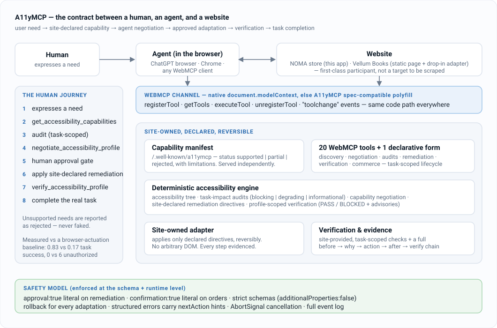
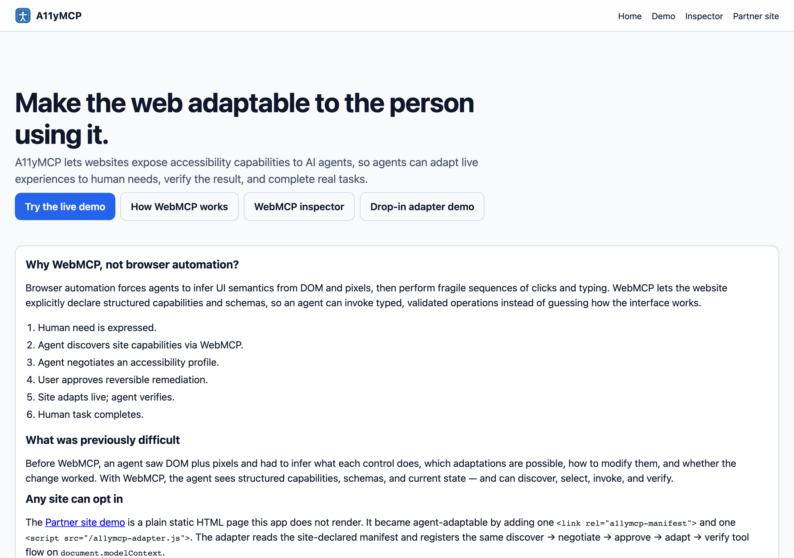
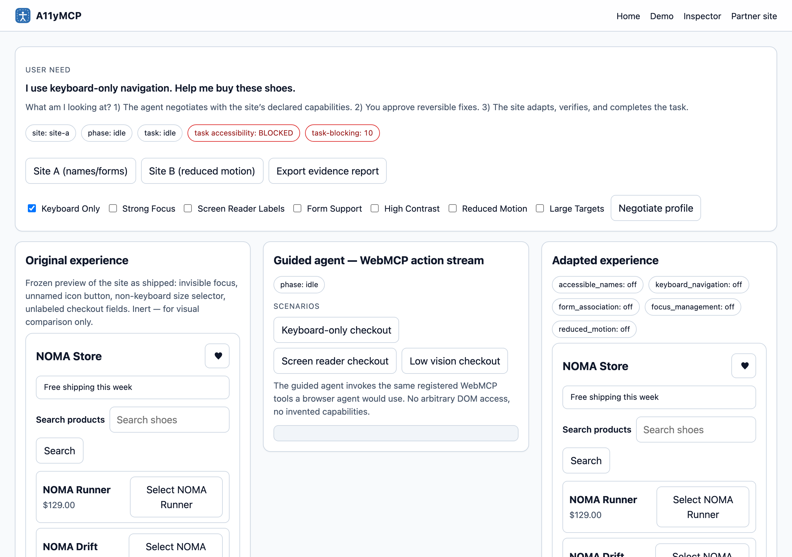
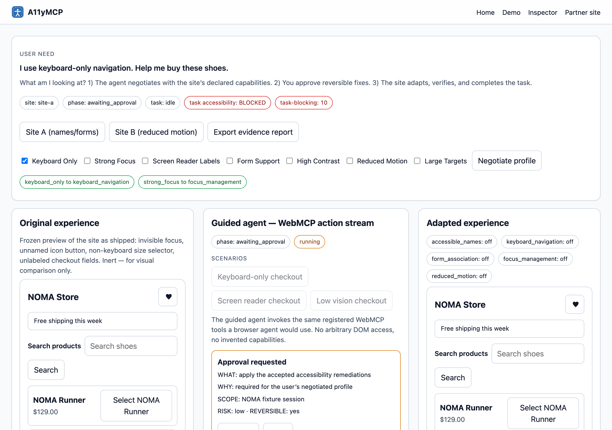
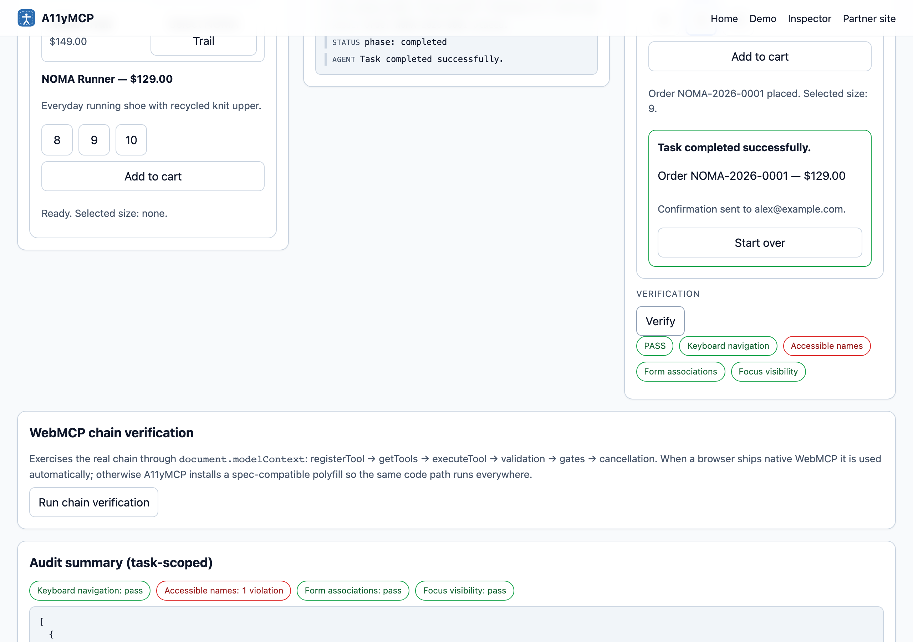
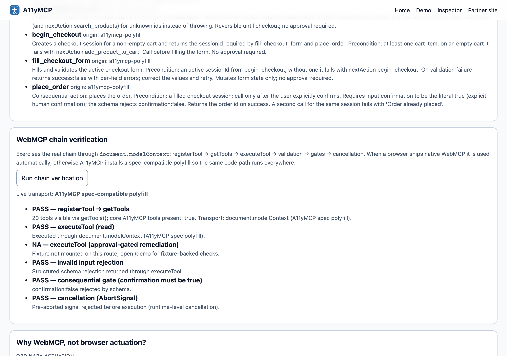
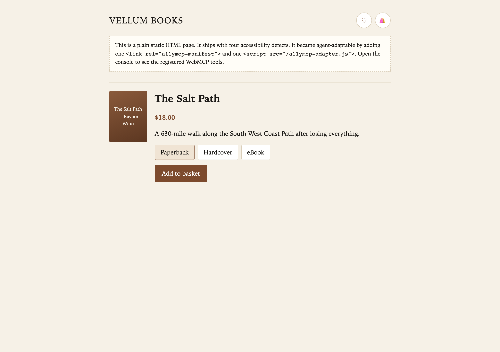

<div align="center">

<picture>
  <source media="(prefers-color-scheme: dark)" srcset="docs/brand/wordmark-dark.svg">
  
</picture>

**Websites declare accessibility capabilities to AI agents — so an agent can adapt a live page to a person's needs, verify the result, and finish the task.**

*The WebMCP Challenge*

[Live demo](https://a11ymcp.vercel.app/demo) · [Inspector](https://a11ymcp.vercel.app/inspector) · [Drop-in adapter demo](https://a11ymcp.vercel.app/partner) · [Architecture](#architecture) · [Run it locally](#run-it-locally)



</div>

---

## WebMCP Challenge — at a glance

**Every submission requirement is met, and every judging criterion maps to something you can click or run.**

| Judging criterion | How A11yMCP answers it | Where |
|---|---|---|
| **WebMCP implementation depth & skill** | Real `document.modelContext.registerTool` / `getTools` / `executeTool` / `unregisterTool` + `toolchange`. 20 imperative tools + 1 declarative form. **Task-scoped lifecycle** — commerce tools register only while a storefront is mounted. A **spec-compatible polyfill** means the same code path runs in every browser and stands down when a native implementation appears. | [`runtime.ts:66`](lib/webmcp/runtime.ts#L66) · [`polyfill.ts:36`](lib/webmcp/polyfill.ts#L36) · [`tools.ts:518`](lib/webmcp/tools.ts#L518) |
| **Complete, coherent product execution** | A full human journey — need → discover → audit → negotiate → approve → adapt → verify → buy — works end to end in `/demo`, **and** works on a plain static third-party page (`/partner`) via a 9 KB drop-in adapter. Landing, demo, inspector, partner site, deployed. | [`guided-demo.ts`](lib/agent/guided-demo.ts) · [`a11ymcp-adapter.js`](public/a11ymcp-adapter.js) |
| **Credible real-world problem-solving impact** | Accessibility is the use case: ~1 in 6 people, and task completion (not a violation count) is the metric. The contract keeps the **site in control** of what it will adapt — the adoption model for e-commerce, banking, gov, health. | [`WHY_A11YMCP.md`](docs/WHY_A11YMCP.md) · [`FOR_WEBSITE_OWNERS.md`](docs/FOR_WEBSITE_OWNERS.md) |
| **Creative & novel concept** | Not another form-filler. **Capability *negotiation*** — the site returns `accepted` / `partial (with limitation)` / `rejected (with reason)`, and the agent never fakes a capability the site didn't declare. | [`negotiation.ts:29`](lib/accessibility/negotiation.ts#L29) |
| Live deployed URL (works in a WebMCP browser) | https://a11ymcp.vercel.app — polyfill in any browser, native `document.modelContext` used automatically where present | [`deployment.md`](docs/evidence/deployment.md) |
| Public repo + OSS license | This repo, **MIT** | [`LICENSE`](LICENSE) |
| Demo video < 3 min, with audio | Shot-by-shot script ready; recording is the one open item | [`VIDEO_SCRIPT.md`](docs/VIDEO_SCRIPT.md) |

**Verify it yourself in one command** (no keys, no account):

```bash
npm i && npm run test && npm run test:e2e && npm run eval:webmcp
# unit + e2e + a measured WebMCP-vs-actuation benchmark, all from real runs
```

```bash
# see that tools go through the real channel, not a private hook:
grep -n "document.modelContext.executeTool" lib/webmcp/runtime.ts tests/eval/*.ts
# see the task-scoped lifecycle:
grep -n "unregisterCommerceA11yTools\|registerCommerceA11yTools" components/fixture/LiveStorefront.tsx lib/webmcp/tools.ts
```

---

## The problem

A website can pass an audit and still stop a specific person from finishing a
specific task: a keyboard-only user who cannot reach the size selector, a
low-vision user with no visible focus, a checkout whose errors are never
announced. Automated scanners find issues for a developer to fix *later*.
Overlays mutate the page without the site's knowledge or consent. Neither
helps the person standing at the checkout **now**.

A11yMCP treats accessibility adaptation as a **contract** between three
parties — the human, their agent, and the website — where the website is a
first-class participant that declares what it can safely adapt, how, and how
to check it worked.

## What it does

Give the agent a need. Through WebMCP tools it then:

| # | Step | Tool | What happens |
|---|------|------|--------------|
| 1 | **Need** | — | "I can only use a keyboard. Buy the NOMA Runner in size 9." |
| 2 | **Discover** | `get_accessibility_capabilities` | Reads the site's declared capability manifest (served at `/.well-known/a11ymcp`). |
| 3 | **Audit** | `audit_keyboard_navigation` … | Task-scoped checks; each finding tagged `blocking` / `degrading` / `informational`. |
| 4 | **Negotiate** | `negotiate_accessibility_profile` | Needs → `accepted` (supported/partial) + `rejected` (with reasons). Undeclared needs are **rejected, not faked**. |
| 5 | **Approve** | *(human gate)* | A trust box: what / why / scope / reversible. The agent waits. |
| 6 | **Adapt** | `repair_keyboard_navigation` … | The **site's own adapter** applies only its declared directives, reversibly. `approval: true` is required at the schema level. |
| 7 | **Verify** | `verify_accessibility_profile` | Re-audits and returns `PASS` / `BLOCKED` **for the negotiated profile**, plus an `advisories` array for everything else. |
| 8 | **Task** | `search_products` → `place_order` | The real purchase. `place_order` needs `confirmation: true` — a literal, schema-enforced. |

Every adaptation is reversible (`rollback_all_remediations`), every step
writes to an event log, and every structured error carries a `nextAction`
recovery hint.

## Why WebMCP, not browser automation

A browser-automation agent infers meaning from DOM + pixels and its only way
to "adapt" a page is to inject CSS/DOM it made up. Four things it structurally
cannot do — and a declared contract can:

| | Browser actuation | WebMCP (A11yMCP) |
|---|---|---|
| **Discover** what adaptations exist | guesses | `get_accessibility_capabilities` |
| **Consent** — does the site allow this change? | no concept | `approval: true` literal, site-owned adapter |
| **Verify** against the site's definition of done | self-built heuristic | `verify_accessibility_profile` (site-provided) |
| **Honesty** on unsupported needs | silently hacks something | `rejected` with a reason — never faked |

A fair, reproducible benchmark (`npm run eval:webmcp`) runs the same tasks on
the same pages with a competent actuation baseline (reads roles/names,
retries) and with WebMCP tools. Numbers are written by the harness, never by
hand:

| | Actuation | WebMCP |
|---|---|---|
| task success rate | **0.17** | **0.83** |
| failed actions | 38 | 6 |
| unauthorized mutations | **6** | **0** |
| verification | heuristic-or-none | structured |

Full methodology, including where actuation *wins* (T5), is in
[`public/eval-results.json`](public/eval-results.json) and rendered at
[`/inspector`](https://a11ymcp.vercel.app/inspector).

## The tool surface

20 imperative tools + 1 declarative form, all with agent-first descriptions
(when / when-not / preconditions / failure-recovery), strict schemas
(`additionalProperties: false`), and MCP annotations. Browse them live with
sample inputs at [`/inspector`](https://a11ymcp.vercel.app/inspector).

| Group | Tools |
|---|---|
| **Discovery & state** | `get_accessibility_capabilities` · `get_accessibility_state` · `inspect_accessibility_tree` |
| **Negotiation** | `negotiate_accessibility_profile` · `submit_accessibility_preferences` *(declarative form)* |
| **Audits** (task-scoped) | `audit_keyboard_navigation` · `audit_accessible_names` · `audit_form_associations` · `audit_focus_visibility` |
| **Remediation** (approval-gated, reversible) | `repair_keyboard_navigation` · `repair_accessible_names` · `repair_form_associations` · `repair_focus_management` · `repair_reduced_motion` · `rollback_all_remediations` |
| **Verification** | `verify_accessibility_profile` |
| **Commerce** (task-scoped lifecycle) | `search_products` · `add_product_to_cart` · `begin_checkout` · `fill_checkout_form` · `place_order` |

## Any site can opt in

[`/partner`](https://a11ymcp.vercel.app/partner) — **"Vellum Books"** — is a
plain static HTML page that this app does not render. It ships with four
accessibility defects. It became agent-adaptable by adding two lines:

```html
<link rel="a11ymcp-manifest" href="/partner/a11ymcp.json" />
<script src="/a11ymcp-adapter.js" defer></script>
```

[`a11ymcp-adapter.js`](public/a11ymcp-adapter.js) (~9 KB, no framework) reads
the site-declared manifest, installs the WebMCP polyfill if the browser has
no native implementation, and registers the same
discover → negotiate → **approve** → adapt → verify → roll back flow
(6 imperative tools + any `form[toolname]` as a declarative tool) on
`document.modelContext`. It **only** applies directives the manifest
declares, and every mutation is reversible. This is the adoption story: a
manifest file plus a script tag.

## Architecture

Next.js App Router. One WebMCP runtime, one deterministic accessibility
engine, one adapter model, exercised two ways — a rich app (`/demo`) and a
static page + drop-in script (`/partner`).

### The WebMCP chain — native, else polyfill

[`registerA11yTool`](lib/webmcp/runtime.ts#L66) registers every tool through
`document.modelContext`. If the browser has no native implementation,
[`ensureModelContext`](lib/webmcp/polyfill.ts#L36) installs a spec-compatible
one (`registerTool` / `unregisterTool` / `getTools` / `executeTool` /
`toolchange`) and **stands down the moment a native one is present**. Every
call in the app — demo, inspector, guided agent, benchmark — is dispatched
through [`invokeTool`](lib/webmcp/runtime.ts#L141) →
`document.modelContext.executeTool`. There is no private bypass;
`/inspector` shows which transport is live, and
[`webmcp-transport-trace.json`](docs/evidence/webmcp-transport-trace.json)
captures the chain.

### Capability negotiation

Most WebMCP demos expose actions. A11yMCP exposes a *negotiation*:
[`negotiateProfile`](lib/accessibility/negotiation.ts#L29) maps the user's
needs against the site's manifest and returns `accepted` (with `supported` |
`partial` + a stated `limitation`) and `rejected` (with a reason). A tool is
never called for a need this step rejected. The same request produces
different outcomes on Site A vs Site B — because the two sites declare
different capabilities.

### Site-declared remediation + the adapter contract

[`applyRemediation`](lib/accessibility/remediation.ts#L112) applies only the
directives the manifest declares for a capability, records a
before → why → action → after → verification evidence chain, and is fully
reversible via [`rollbackAll`](lib/accessibility/remediation.ts#L195). There
is no arbitrary-DOM tool. The rules are in
[`a11ymcp-contract/adapter-contract.md`](a11ymcp-contract/adapter-contract.md).

### Profile-scoped verification

[`buildVerification`](lib/accessibility/verification.ts#L49) returns
`PASS` / `BLOCKED` **for the negotiated profile only**. A keyboard-only user
who negotiated keyboard + focus is not "blocked" because an unrelated icon
button lacks a name — that is reported in `advisories`. Verification confirms
exactly what was agreed, nothing more, nothing less.

### Task-scoped tool lifecycle

15 core tools are always registered. The 5 commerce tools are registered by
[`LiveStorefront`](components/fixture/LiveStorefront.tsx#L16) **only while a
storefront is on the page** and `unregisterTool` on unmount (emitting
`toolchange`). This follows the March 2026 spec revision that removed
`provideContext` to discourage "ghost tools." `document.modelContext.getTools()`
returns 15 on `/` and 21 on `/demo` (20 imperative + the declarative
`submit_accessibility_preferences` form).

### Safety model

| Control | Mechanism |
|---|---|
| No arbitrary DOM/JS tool | the tool surface is closed; only declared directives apply |
| Consent for adaptations | [`ApprovalInputSchema`](lib/webmcp/schemas.ts#L14) rejects missing/`false` `approval` |
| Consent for consequential actions | [`PlaceOrderInputSchema`](lib/webmcp/schemas.ts#L119) requires the literal `confirmation: true` |
| Reversibility | `rollback_all_remediations`; the adapter records an undo for every change |
| Bad input | strict Zod + JSON schemas; structured errors carry `nextAction` |
| Runaway work | `AbortSignal` honored at the runtime level for every tool |
| Auditability | full event log; a re-run order is rejected; stale state is rejected |

### Decisions worth pointing at

| | |
|---|---|
| **The transport is real, or an honest polyfill — never a private hook** | The benchmark used to reach into a `?eval=1` global. Now [`tests/eval/benchmark.spec.ts`](tests/eval/benchmark.spec.ts) calls `document.modelContext.executeTool` like any agent would. |
| **Verification is scoped, so "PASS" means something** | Global "all audits pass" made the flagship keyboard task fail its own benchmark. Scoping to the negotiated profile is both more correct and on-thesis. |
| **The adapter is decoupled from the app** | [`a11ymcp-adapter.js`](public/a11ymcp-adapter.js) is vanilla JS driven entirely by a manifest file — proof the contract model isn't wired into one framework. |
| **Unsupported needs fail loudly** | `high_contrast` on a site that doesn't declare it returns `rejected`, and `repair_reduced_motion` on Site A returns `success: false` with an evidence chain — not a silent no-op. |

### Where things live

| Path | Role |
|---|---|
| `lib/webmcp/` | `runtime` (register/execute/lifecycle) · `polyfill` · `tools` (the 20 tools) · `schemas` |
| `lib/accessibility/` | `manifest` · `tree` · `audits` · `negotiation` · `remediation` · `verification` · `profiles` · `evidence-report` |
| `lib/ecommerce/` | deterministic NOMA catalog / cart / checkout |
| `lib/agent/` | `guided-demo` (a labelled, deterministic agent) · `intent-parser` |
| `app/` | `/` landing · `/demo` · `/inspector` · `/.well-known/a11ymcp` · `/api/a11ymcp-manifest` |
| `public/` | `a11ymcp-adapter.js` · `partner/` (static third-party page + its manifest) |
| `a11ymcp-contract/` | manifest + adapter-manifest schemas · capability spec · adapter contract · two example site configs · README |
| `tests/` | `unit/` (95) · `e2e/` (golden + negatives + adapter) · `eval/` (benchmark + transport trace) |

## Evidence

| Artifact | What it shows | Regenerate |
|---|---|---|
| [`docs/evidence/webmcp-transport-trace.json`](docs/evidence/webmcp-transport-trace.json) | `registerTool → getTools → executeTool`, schema + gate rejections, task-scoped `unregisterTool` | `npm run eval:webmcp` |
| [`public/eval-results.json`](public/eval-results.json) | measured WebMCP-vs-actuation benchmark (0.83 vs 0.17 task success) | `npm run eval:webmcp` |
| `npm run test` | 95 unit tests — schemas, audits, negotiation, verification scoping, polyfill, security negatives | — |
| `npm run test:e2e` | golden purchase path, security negatives, **the drop-in adapter on the static page** | — |
| `npm run eval:tools` | agent-first tool-description scorecard | — |
| [`docs/evidence/external-agent-transcript.md`](docs/evidence/external-agent-transcript.md) | *optional* — a run in a browser with **native** WebMCP. Not captured; not a dependency of any claim. | — |

## Screenshots

| | |
|---|---|
|  **The pitch** |  **Task BLOCKED before adaptation** |
|  **Negotiated profile + human approval gate** |  **Adapted, verified (PASS), order placed** |
|  **The real chain + live transport** |  **A static third-party page, made adaptable** |

Regenerate: `node docs/capture-screenshots.mjs` (drives headless Chromium; no account).

## Accessibility of A11yMCP itself

Keyboard operable, visible focus, landmarks, `aria-live` on the tool event
log and agent stream, `role="alertdialog"` on the approval and confirmation
gates, and `prefers-reduced-motion` support. The audit engine is a
documented runtime proxy — see
[`docs/ACCESSIBILITY_METHODOLOGY.md`](docs/ACCESSIBILITY_METHODOLOGY.md) for
the task-impact taxonomy, the focus-probe's limits, and an AT-testing
runbook.

## Run it locally

**Prerequisites:** Node 20+. No API keys, no accounts, no external services.

```bash
git clone https://github.com/TusharTechs/A11yMCP.git && cd A11yMCP
npm install
npm run dev            # http://localhost:3000
```

Open `/demo`, click **Keyboard-only checkout**, approve the adaptation,
confirm the order. Then open `/inspector` and run **chain verification**, and
`/partner` to see the drop-in adapter register tools on a static page (check
the console).

```bash
npm run test          # 95 unit tests
npm run test:e2e      # golden path + security negatives + adapter
npm run eval:tools    # tool-quality scorecard
npm run eval:webmcp   # benchmark + transport trace -> writes JSON evidence
npm run build         # production build
```

## Limitations

Controlled demo sites; a supported barrier set (keyboard, names, form
association, focus visibility, reduced motion) framed as a reference set, not
a WCAG engine; verification is task-scoped evidence, not legal ADA/WCAG
certification; the capability manifest format is a labelled prototype
convention, not a ratified standard; the guided agent is deterministic and
labelled as such (a native-WebMCP agent drives the identical tool path).

## Tech

Next.js 16 (App Router) · React 19 · TypeScript · Zod · `document.modelContext`
(+ spec polyfill) · vanilla-JS drop-in adapter · Playwright · Vitest ·
95 unit tests · reproducible benchmark · zero runtime dependencies beyond
`next` / `react` / `zod`

## Demo video

[`docs/VIDEO_SCRIPT.md`](docs/VIDEO_SCRIPT.md) is a 2:50 shot list that puts
every judging hook on screen: the blocked task, discovery through
`document.modelContext`, negotiation with an honest rejection, the approval
gate, live adaptation + rollback, profile-scoped verification, the completed
purchase, and the measured benchmark.

## License

[MIT](LICENSE) — free to use, modify, and distribute, including commercially.
